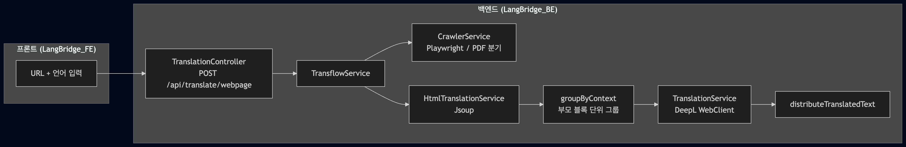
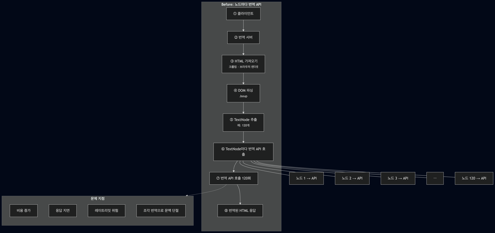
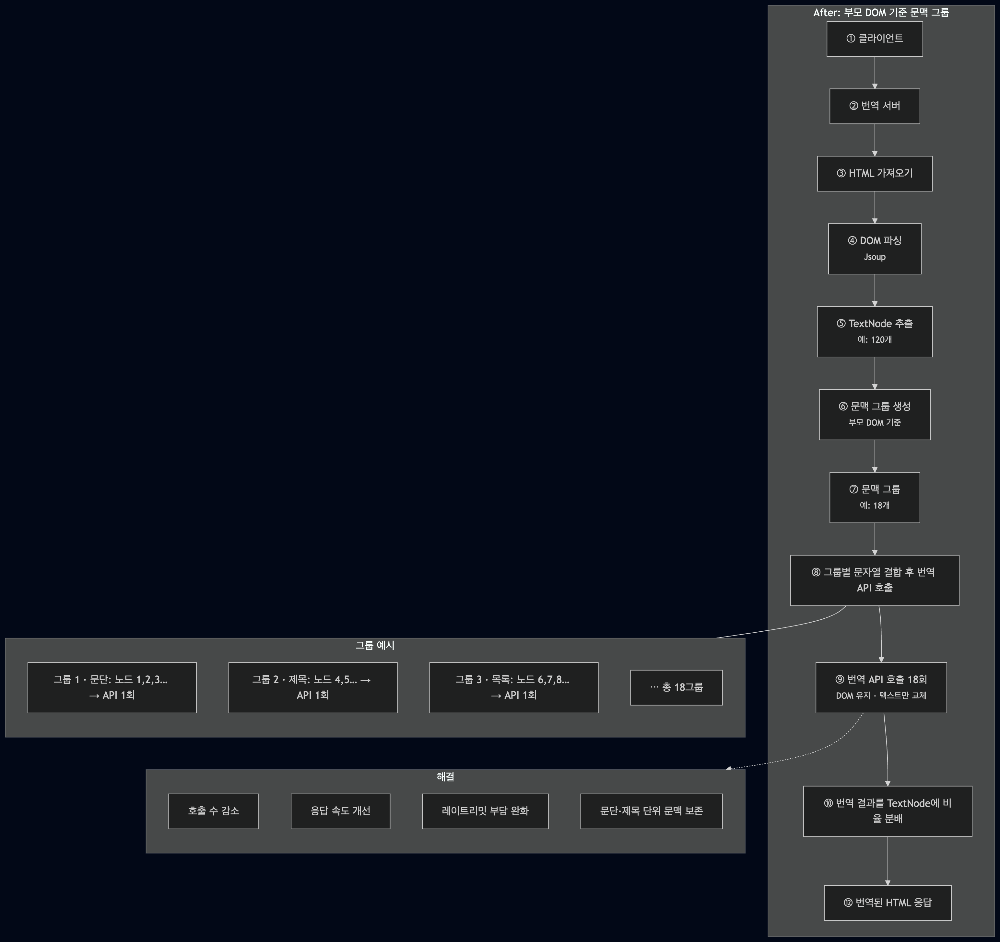
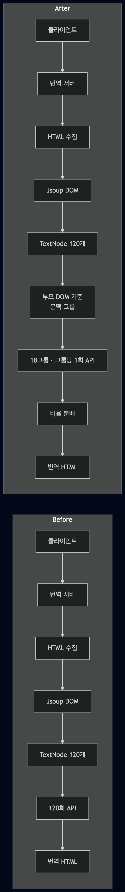
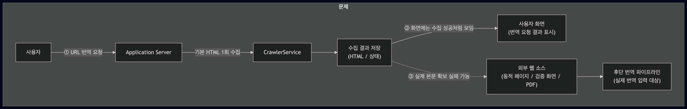
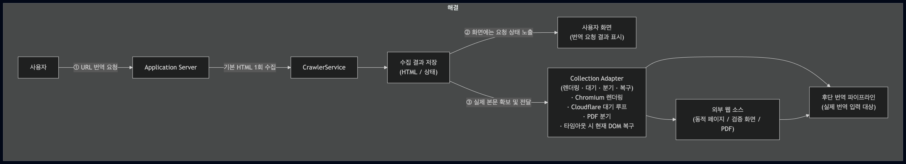
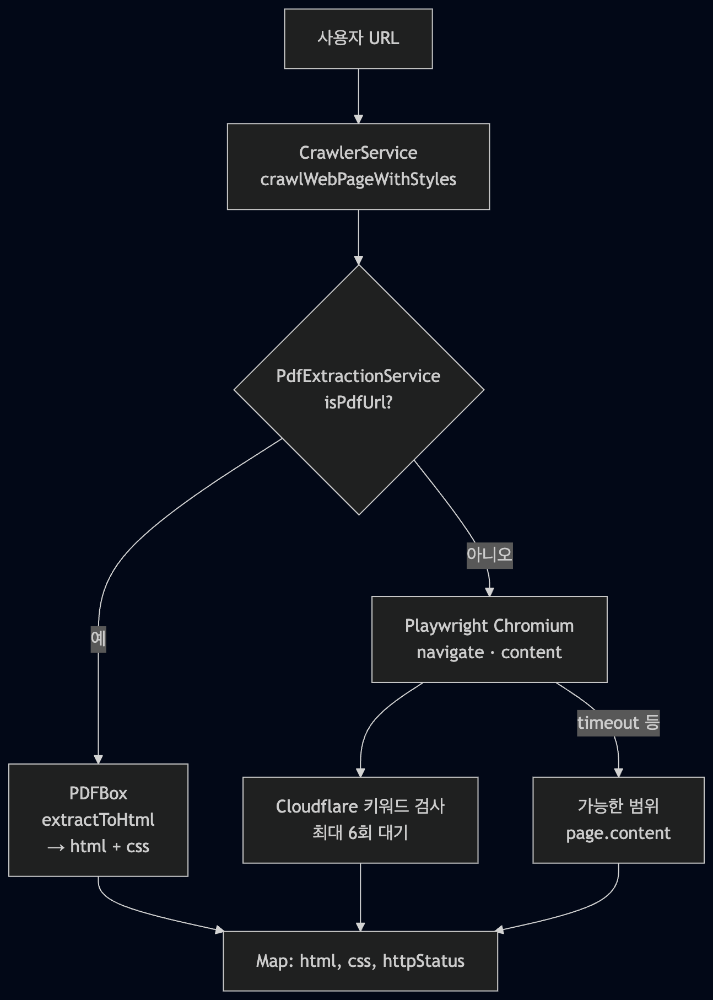

# LangBridge

## 프로젝트 소개

본 프로젝트는 자원봉사 번역팀의 협업 과정을 효율적으로 지원하기 위한 웹 기반 번역 관리 서비스이다. 기존 이메일·메신저·구글 드라이브 중심의 번역 작업 방식에서 발생하던 진행 상황 파악의 어려움, 버전 혼선, 용어 불일치, 반복적인 수작업 문제를 해결하는 것을 목표로 한다.
서비스는 AI 기반 초벌 번역과 봉사자의 검토·수정 과정을 결합한 구조로 설계되었으며, 원문 수집부터 최종 게시까지의 전체 번역 워크플로우를 하나의 플랫폼에서 통합 관리할 수 있도록 구성하였다.

### 개발 기간

- 2025.12 ~


### 배포 주소
- 서비스 주소: [`https://lb.walab.info`](https://lb.walab.info)

### 팀 소개
| [**우병희**](https://github.com/dnqudgml12) | [**곽서원**](https://github.com/seowon1112) | [**윤동혁**](https://github.com/Diggydogg) |
|---|---|---|
| Frontend, Backend | Frontend, Backend | Infra, Backend |


### 전체 플로 (다이어그램 1 — URL 웹페이지 번역 1건)

브라우저에서 번역 버튼을 누르면, 백엔드 안에서는 대략 **컨트롤러 → 오케스트레이션 → 수집 → DOM·그룹·번역 → 응답** 순으로 이어진다.





### ① TextNode 컨텍스트 그룹핑으로 번역 API 호출·품질 개선

HTML은 태그 단위로 쪼개지면 **TextNode**가 수십~수백 개가 될 수 있다. **가정상 비효율인 모델**(노드마다 API 1회)과 비교하면, 아래 구현은 **같은 부모 블록 안의 노드를 한 덩어리 문자열로 합친 뒤 그룹당 DeepL 호출 1회**로 줄인다.

백엔드 `HtmlTranslationService`에서는 **Jsoup**으로 DOM을 파싱한 뒤 `groupByContext`로 부모 요소(`p`, `h1`~`h6`, `li`, `td`/`th`, `blockquote`, `article`, `section`, `div`, `span` 등을 올라가며 문맥 단위)가 바뀔 때마다 새 그룹을 만든다. 그룹마다 문자열을 이어 붙인 뒤 `translationService.translate(...)`로 **한 번** 보내고, `distributeTranslatedText`로 원래 TextNode에 나눠 넣어 **마크업 구조를 유지**한다. 그룹 단위 호출이 실패하면 해당 그룹만 **노드별 `translate`로 폴백**한다. 언어쌍별 **용어집(Glossary) ID**도 넘길 수 있다.

> 참고: `TranslationService`에는 여러 문장을 한 HTTP 요청에 실어 보내는 **배치 번역** API도 있으나, 문맥 그룹 경로의 기본은 **그룹당 단일 문자열 1회 호출**이다.

**측정 예(문서 기준, DOM 구조에 따라 가변)**

| 본문 규모(문자) | 그룹핑 전 API 호출(예) | 그룹핑 후(예) | 호출 감소율 |
|----------------|----------------------|----------------|------------|
| 1,270 | 20 | 4 | 약 80% |
| 10,025 | 127 | 18 | 약 85.8% |
| 110,503 | 433 | 62 | 약 85.7% |

**검토 후 채택하지 않은 방향**

- 노드별 개별 호출: 비용·지연·품질 이슈.
- DeepL HTML 모드 단독 사용: 스크립트 제거·용어집 등 **사전 가공 파이프라인**과의 결합이 어렵다는 이유로 자체 HTML 보존 번역 경로를 유지한다.

#### 다이어그램 (Before / After)

**Before — 노드마다 API (비교용)**



**After — 문맥 그룹 (LangBridge 구현 요지)**



**한눈에 비교**




---

### ② Playwright 기반 크롤링 — 동적 페이지·봇 차단·타임아웃·PDF (다이어그램 2)

단일 URL만 받아도 **JS 렌더링**, **Cloudflare류 검증 페이지**, **PDF**가 섞일 수 있다. 슬라이드의 **「Collection Adapter」**에 해당하는 역할은 코드상 **`CrawlerService`**(+ PDF 시 **`PdfExtractionService`**) 한 덩어리로 모여 있다.

#### 문제 vs 해결 (수집 계층 — Mermaid)

아래 Mermaid는 **슬라이드와 동일한 단계·①②③·노드 이름**을 맞춘 것이다. 구현체는 **`CrawlerService`**(+ PDF 시 **`PdfExtractionService`**)가 Collection Adapter 역할을 수행한다.

**문제**



> **문제 지정:** 초기 HTML만으로는 실제 본문을 보장하지 못함.  
> **결과:** 화면상 성공처럼 보여도 번역 입력은 빈 본문·검증 화면·PDF 실패가 될 수 있음.

**결과:** 사용자 기대와 실제 번역 입력이 불일치.

**해결**



> **해결:** Collection Adapter를 추가해 외부 소스 특성을 흡수.  
> **결과:** 사용자 화면과 실제 번역 입력이 일치하고 수집이 안정화됨.

**결과:** HTML / PDF / 동적 페이지를 한 파이프라인에서 안정적으로 처리.

- **PDF 분기**: `PdfExtractionService.isPdfUrl(url)` — `?`·`#` 앞 경로가 `.pdf`로 끝나면 PDF로 간주하고, 아니면 **HEAD**로 `Content-Type`에 `application/pdf`가 있는지 본다. PDF면 **Apache PDFBox**로 텍스트를 뽑아 `crawlWebPageWithStyles`와 동일한 형태(`html`, `css`, `httpStatus`)로 맞춘다.
- **HTML 페이지**: **Playwright(Chromium)** 로 `navigate` 후 본문을 가져온다. HTML에 `verify you are human`, `just a moment` 등이 보이면 **최대 6회 × 약 5초** 대기 루프로 통과를 기다린다.
- **타임아웃**: 네비게이션 중 예외가 나도 가능하면 `page.content()`로 **현재까지의 DOM**을 돌려내려 한다.
- **Playwright 미기동**: `crawlWebPageWithStyles`는 PDF가 아닌데 Playwright가 `null`이면 예외를 던진다. (레거시 **Jsoup 전체 페이지 폴백** 메서드는 있으나 **deprecated**, 메인 경로에서는 사용하지 않는다.)
- **Jsoup**: 번역 단계의 DOM 가공·텍스트 수집, 크롤러의 CSS 보조 등에 쓰이고, **페이지 본문 1차 수집의 기본 수단은 Playwright**다.

#### 크롤링 분기 (Mermaid)



---

### 프론트엔드에서의 역할

- **역할 기반 사이드바**(`sidebarMenu.ts`): `SUPER_ADMIN` / `ADMIN` / `VOLUNTEER` 에 따라 메뉴 노출.
- **긴 번역 요청 대응**: Axios `timeout` **300000ms(5분)** — 대량 TextNode·크롤링에 맞춤.
- **공개 vs 앱 영역**: `/` 는 레이아웃 없이 랜딩, 그 외 `Layout` + 인증 UI.
- **TipTap**: 번역 가이드·문서 작업 등 리치 편집.
- **ErrorBoundary**: 주요 라우트마다 격리.

---

## 배포 · 실행 환경

- 로컬: `npm run dev` → 기본 **http://localhost:3000** (`vite.config.js`).
- 백엔드: **http://localhost:8080** (Spring Boot). CORS 허용 출처는 BE `application.yml`의 `app.cors.allowed-origins` 등과 맞출 것.
- 정적 배포 시: `npm run build` 산출물을 **nginx / S3+CloudFront / Vercel(static)** 등에 두고, `VITE_API_URL`을 운영 API 베이스로 설정.

---

## 시작 가이드

### 요구 사항

- **Node.js** (LTS 권장)
- **npm**
- 실행 중인 **LangBridge_BE** (또는 동일 API를 제공하는 서버)

### 환경 변수

프로젝트 루트에 `.env` 또는 `.env.local`:

```bash
# API 베이스 (백엔드 context-path가 / 이면 /api 까지 포함)
VITE_API_URL=http://localhost:8080/api
```

로그인·OAuth 콜백 URL은 백엔드 `FRONTEND_URL`, `GOOGLE_REDIRECT_URI` 등과 일치시켜야 한다.

### 설치 및 실행

```bash
git clone <저장소 URL>
cd LangBridge_FE
npm install
```

**개발 서버**

```bash
npm run dev
# 또는
npm start
```

**프로덕션 빌드 및 프리뷰**

```bash
npm run build
npm run preview
```

### 기타 스크립트

```bash
npm run lint   # ESLint
```

---

## 기술 스택

### 개발 환경


### 언어 · 프레임워크


### HTTP · UI


### 아이콘 · 품질


### 백엔드 (LangBridge_BE)

프론트가 호출하는 API는 **Spring Boot 2.7** 기반 **LangBridge_BE**에서 제공한다. 

#### 런타임 · 빌드


#### 데이터 · 영속성


-004088?style=for-the-badge)

#### 보안 · 인증 · 메일


-000000?style=for-the-badge&logo=jsonwebtokens&logoColor=white)


#### HTTP 클라이언트 · API 문서


#### 크롤링 · 문서 · 유틸


#### 번역 · 기타


> DeepL 호출은 **Spring WebClient**(WebFlux)로 수행하며, API 키는 DB·설정에서 관리하는 흐름을 쓴다. 

---

## 화면 구성 · 라우트

| 경로 | 설명 |
|------|------|
| `/` | 랜딩 / 로그인 진입 |
| `/translate` | URL·언어 선택 웹페이지 번역(탭 UI) |
| `/editor` | 웹 기반 편집기 |
| `/dashboard` | 대시보드 |
| `/translation-guide` | 번역 가이드 |
| `/translations/pending` | 번역 대기 문서 |
| `/translations/working` | 내가 작업 중인 문서 |
| `/translations/favorites` | 찜한 문서 |
| `/translations/new` | 새 번역 등록 |
| `/translations/:id/work` | 문서별 번역 작업 화면 |
| `/documents` | 전체 문서 |
| `/documents/handovers` | 인계 요청 문서 |
| `/documents/:id` | 문서 상세 |
| `/reviews` | 검토 목록 |
| `/reviews/:id/review` | 문서 검토 화면 |
| `/inquiries` | 문의 게시판 목록 |
| `/inquiries/new`, `/inquiries/:id`, `/inquiries/:id/edit` | 문의 작성·상세·수정 |
| `/glossary` | 용어집 |
| `/users` | 사용자 관리 |
| `/settings` | 시스템 설정 |
| `/activity` | 내 활동(플레이스홀더) |

> 스크린샷은 `docs/` 에 `langbridge-*.png` 형식으로 추가하면 본 표 아래에 갤러리처럼 붙이기 좋다.

---

## 아키텍처 및 디렉터리 구조

```text
LangBridge_FE/
├── public/                 # 정적 자산
├── docs/                   # README용 다이어그램·스크린샷
├── src/
│   ├── pages/              # 라우트 단위 페이지
│   ├── components/         # Layout, Sidebar, Modal, Table, 에디터 등
│   ├── contexts/           # UserContext, SidebarContext
│   ├── hooks/              # usePermission, useInquiryBadge 등
│   ├── services/           # api.js(axios), *Api.ts
│   ├── types/              # user, document, translation, dashboard
│   ├── constants/          # sidebarMenu, designTokens, 라벨
│   ├── utils/              # 권한·날짜·카테고리 등
│   ├── App.tsx
│   └── main.tsx
├── index.html
├── package.json
├── vite.config.js
├── tailwind.config.js
├── postcss.config.js
└── tsconfig.json
```

---

## 백엔드 API (프론트 연동 요약)


| 프리픽스 | 용도 |
|----------|------|
| `POST /translate/webpage` | URL 크롤링 + HTML 보존 번역 |
| `POST /translate/html` | HTML 문자열 직접 번역 |
| `GET /translate/health` | 번역 서비스 헬스 |
| `/auth/*` | 로그인 성공/실패 콜백, me, logout 등 |
| `/documents`, `/documents/{id}/versions`, `/documents/{id}/comments` | 문서·버전·댓글 |
| `/tasks` | 번역 작업(할당 등) |
| `/reviews` | 검토 |
| `/inquiries` | 문의 |
| `/terms` | 용어집 |
| `/categories` | 카테고리 |
| `/users`, `/admin` | 사용자·관리 |
| `/settings` | 시스템 설정·API 키 |

전체 스펙은 백엔드 **Swagger UI** (`/swagger-ui.html`)를 참고한다.

---

## 문의

이슈·PR 환영. 백엔드 저장소는 **LangBridge_BE** 와 함께 보면 전체 플로를 이해하기 쉽다.
